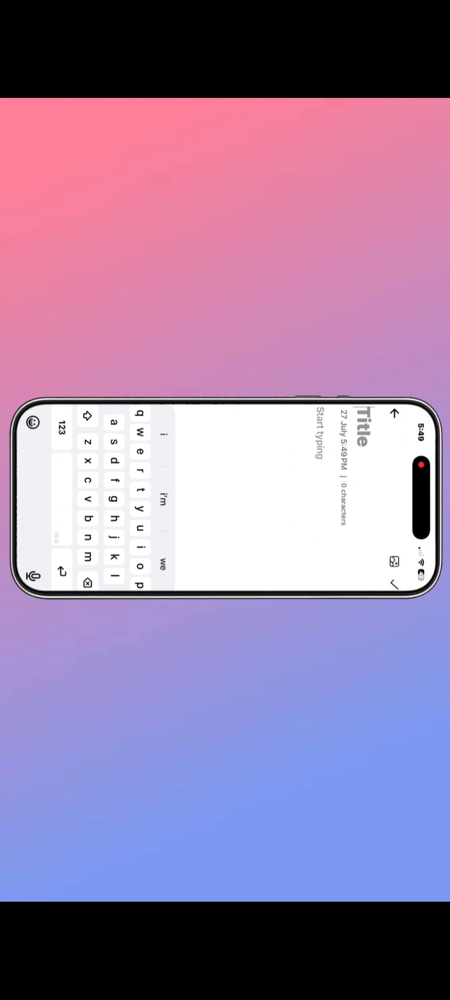
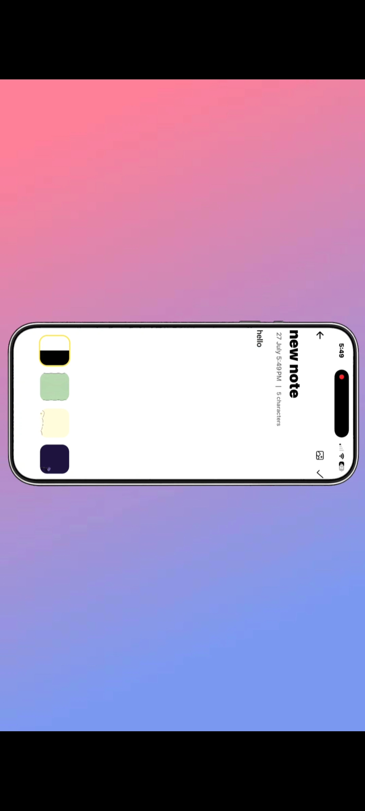
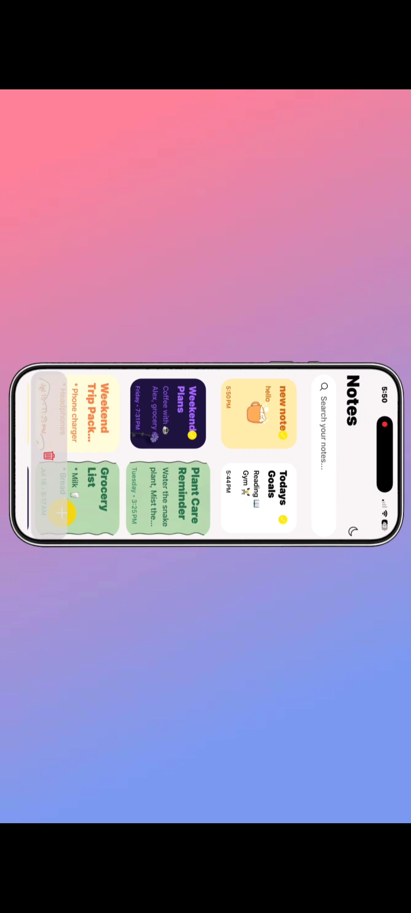
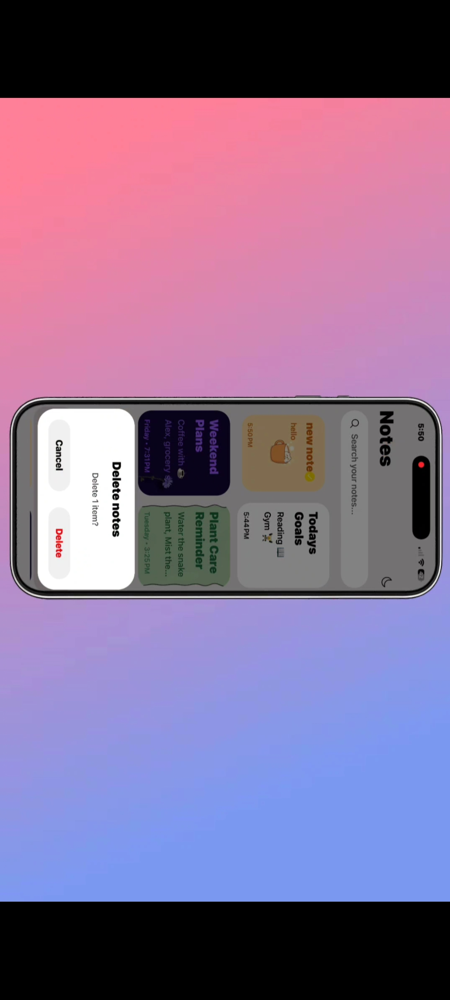

# 📝 Note App Expo

> 📱 A beautiful and modern note-taking app built with Expo and React Native.

A modern and elegant Notes application built with **React Native**, **Expo**, and **TypeScript**.

Create, edit, search, and organize your notes with a clean user interface, smooth animations, beautiful themes, and persistent local storage.

---

## 🎥 Demo

A 30-second walkthrough of the application is included in:

**assets/videos/demo.mp4**

> After pushing this repository to GitHub, this will be replaced with an embedded video preview.

---

## 📸 Screenshots

| Home                                                                           | Search                                                                         |
| ------------------------------------------------------------------------------ | ------------------------------------------------------------------------------ |
|  |  |

| Theme                                                                          | Note Details                                                                   |
| ------------------------------------------------------------------------------ | ------------------------------------------------------------------------------ |
|  |  |

---

## ✨ Features

- 📝 Create, edit and delete notes
- 🔍 Instant note search
- 🎨 Beautiful customizable note themes
- 🌙 Dark & Light mode support
- 💾 Notes are automatically saved locally using AsyncStorage
- ⚡ Smooth animations powered by React Native Reanimated
- 📱 Responsive two-column layout
- ✅ Multi-select and delete multiple notes
- 🚀 Fast, lightweight and user-friendly experience

---

## 🛠 Tech Stack

- **React Native**
- **Expo SDK 54**
- **TypeScript**
- **Expo Router**
- **React Native Reanimated**
- **AsyncStorage**
- **Expo Image**
- **Expo Vector Icons**

---

## 📂 Project Structure

```text
src/
├── app/
│   ├── components/
│   ├── constants/
│   ├── note/
│   ├── new.tsx
│   └── index.tsx
│
├── context/
├── data/
├── types/
```

---

## 🚀 Getting Started

Clone the repository:

```bash
git clone https://github.com/astralvoidd/note-app-expo.git
```

Navigate to the project directory:

```bash
cd note-app-expo
```

Install dependencies:

```bash
npm install
```

Start the development server:

```bash
npx expo start
```

Scan the QR code using **Expo Go** on your Android or iOS device.

---

## 📦 Built With

- Expo SDK 54
- React Native 0.81
- React 19
- TypeScript

---

## 📄 License

This project is licensed under the **MIT License**.

---

## 👨‍💻 Author

Built with ❤️ by **astralvoidd**

If you enjoyed this project, consider giving it a ⭐.

If you have any suggestions or feedback, feel free to open an issue or submit a pull request.
